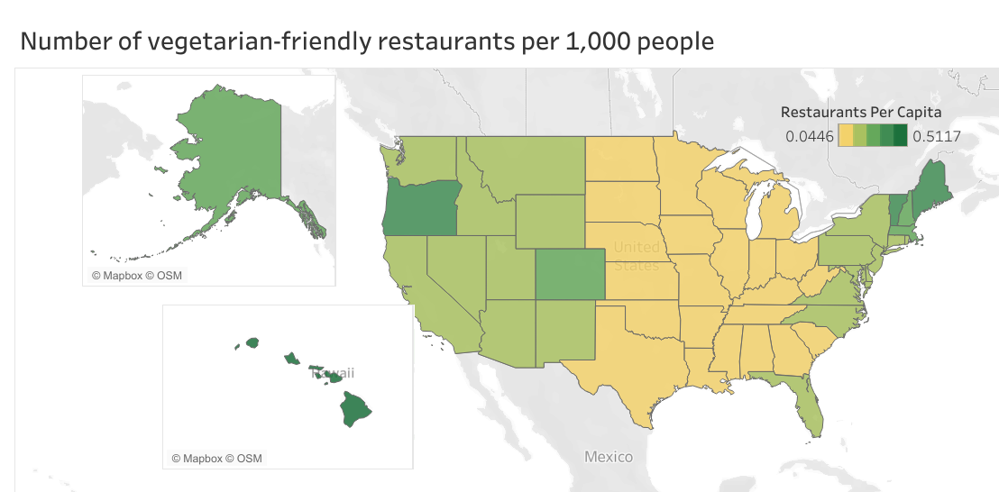

## Introduction
In 2022 I made the decision to become a vegetarian, while also putting in extra effort to cook almost exclusively vegan meals at home. A common topic of debate in the vegan community is whether or not it is easier for certain communities to adopt healthy and plant-based diets than it is for others. Personally, I think the answer to this question is a no-brainer, but nonetheless would like to explore it with data.  

!! talk about the importance and benefits of a veg lifestyle
While a vegetarian or vegan diet isn’t for everyone, the reduction of human consumption of meat for nutritionally equal or healthier plant-based alternatives has been shown to be beneficial on multiple levels. Farming for animal products is one of the world’s biggest contributors to climate change. (water use, land use)
On an individual level, reducing the amount of meat one eats (while, again, still taking care to keep a well-balanced diet) has repeatedly been shown  

There are many factors to consider when it comes to transitioning to a new diet, but for this study I will be judging how easy it is to be a vegetarian or vegan based on how many restaurants with vegetarian or vegan options are available, as this data is easy to access and eating out at restaurants that often will not accommodate your dietary restrictions is one of the most difficult parts of having a plant-based diet.  


## Hypothesis
There are more meat-free and plant-based dining options in areas with high levels of income, as well as those with larger populations. 


## Preparation
The primary dataset I'll be using is a table containing the amount of vegetarian- and vegan-friendly restaurants per state. By vegetarian/vegan-friendly, I refer to restaurants that provide food that is meat- or animal-product-free on their menus. This data was scraped from the website HappyCow, an online directory of such restaurants, and was the most accurate I could find.
Most of the sets containing the demographic data I'll be using are sourced from the U.S. Census Bureau; for consistency, this data was also collected in 2018. The additional data on political party preference was collected in 2018 by Gallup.
 
The tools I will be using are:  
  
- Data Scraping: Python with Selenium
- Cleaning: PostgreSQL/PGAd4min4, Microsoft Excel
- Exploration/Analysis: Python with numpy, pandas, and scipy
- Visualization: Python with Seaborn, Tableau
- Final report: rmarkdown


## Processing and Cleaning Data
The collected Happy Cow data was simple and straightfoward, and thus did not require any major cleaning. I also originally used SQL to process a dataset of fast food restaurants, but tossed this set after realizing it doesn't contribute to answering the question at hand.

## Analysis
From here I begun my exploratory data analysis.
```{python}
# Loading the necessary packages
import numpy as np
import pandas as pd
import openpyxl
import seaborn as sns
import matplotlib.pyplot as plt
sns.set_theme(style="whitegrid")
from scipy.stats import pearsonr

# Loading the vegetarian restaurant data
veggiefood = pd.read_excel("C:/Users/Noah/Coding/food_study/data/clean_data/veggie_restaurants_per_state.xlsx", usecols="A, B")

# Loading in state data
statepop = pd.read_excel("C:/Users/Noah/Coding/food_study/data/clean_data/state_populations_2018.xlsx", engine='openpyxl')
statepop.columns = ['name', 'population']
# Creating a Series of each state and its population
populations = statepop['population']
populations.index = statepop['name']

# Our first look at the vegetarian restaurant data, sorted by the number of restaurants
veggiefood.sort_values(['num_of_restaurants'], ascending=False).head()
```
Once again, many of the highest-ranking states, such as New York, California, Florida, and Texas, are those with the highest populations. Per-capita calculations follow.
```{python echo=T, results='hide'}
# Convert vegetarian data to a series so we can perform arithmetic with the populations data series
veggie_sorted = veggiefood.sort_values(['state'])
veggie_sorted = pd.Series(data=list(veggie_sorted['num_of_restaurants']), index=veggie_sorted['state'])

veg_per_capita = veggie_sorted.divide(populations) * 1000
veg_per_capita = veg_per_capita.sort_index(0, False)
veg_per_capita = veg_per_capita.sort_values(0, False)
```
```{python}
fig, ax = plt.subplots(figsize=(7, 13))
graph = sns.barplot(x=veg_per_capita.values, y=veg_per_capita.index, orient='h', ax=ax)
graph.set(title='Number of vegetarian-friendly restaurants per state, per capita (1,000 people)')
```
Disregarding Washington DC, the state with the highest per-capita amount of vegetarian-friendly restaurants is Hawaii, with one such business per 2,000 people. Mississippi, in last place, has a dearth of vegetarian options with only one to every 22,200 people. However, it's important to note that HappyCow's data is user-provided; it's entirely possible that states such as OK, KY, and MS simply may not have many people who know about their website, and thus few submissions.  
Before testing these figures against several demographic variables, we can also see a pattern in an initial geographic map, as shown below.


It's now clear that eating out as a vegetarian or vegan is not as easy in the American Midwest than as it is on either coast. However, it's worth exploring just what characteristics of different states, such as wealth and political beliefs, may be contributing the most to this contrast.

### Exploring the relationship between the number of vegetarian restaurants and demographic variables  

#### Variable 1: Political Party
```{python}
# Load in the data containing political party identification figures per state
party = pd.read_excel("C:/Users/Noah/Coding/food_study/data/clean_data/state_party_and_identification_2018.xlsx", engine='openpyxl')

party.head()
```
```{python}
# Calculate the percentage of democratic identification per state
partyTotal = pd.Series(party['Democrat'] + party['Republican'])
partyTotal.index = party['State']
dem = party['Democrat']
dem.index = party['State']
```
```{python}
demPerc = dem.divide(partyTotal)
demPerc.head()
```
```{python}
# Removing DC from vegetarian data, since it's not in political data
veg2 = veg_per_capita.drop(labels='District of Columbia',
        axis=0, inplace=False)
veg2 = veg2.sort_index(0,False)

# Merging the data to later plot it
partyFull = pd.DataFrame({'restaurants_per_capita': veg2.values, 'percent_democrat': demPerc.values},
        index=veg2.index)
partyFull.head()
```
```{python}
# THERES SOMETHING WRONG WITH THIS CHUNK HAVE FUN SOLVING IT LOL
# create scatterplot with the two variables of interest
fig, ax = plt.subplots(figsize=(7, 6))
sns.regplot(partyFull, 
    x='percent_democrat', 
    y='restaurants_per_capita').set(
        xlabel='% of Democrats', 
        ylabel='Number of Restaurants', 
        title='Number of Vegetarian-Friendly Restaurants (per 1,000 People) to State % of Self-Identified Democrats')


# calculate pearson correlation coefficient
r, p = pearsonr(x=partyFull['percent_democrat'], y=partyFull['restaurants_per_capita'])
# include values as annotations
ax.text(.45, 0.33, 'r = {:.3f}'.format(r))

plt.show()
```
The relationship between political party and the number of vegetarian-friendly restaurants has a low-to-moderate *r* of 0.487. It's likely that we can disregard this variable.


income data is not adjusted for inflation!!

demographics of democrats v republicans

A major caveat is also the fact that the webscraped data wasn't collected in the same year as the other datasets -- This data includes, for example, many fast food restaurants which have only introduced vegetarian/vegan options in recent years since the other data was collected.

Didn't take into consideration family size, relationship status, disability, etc.  
For example, a single, working mother of four picky children would not have as easy of a time going vegetarian as I did.